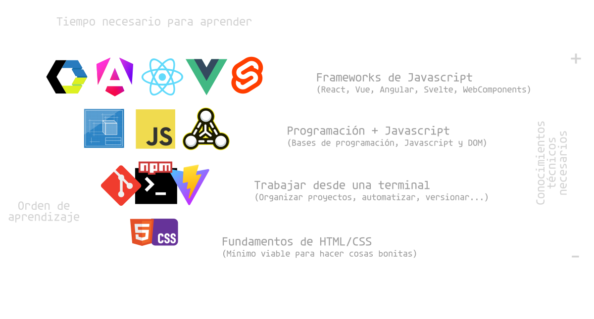

# ¿Qué ruta seguir para aprender?

A la hora de aprender desarrollo web, los desarrolladores que comienzan suelen frustarse por no tener una estructura clara sobre que vas avanzando, aparecen más tecnologias y conceptos, es un gran problema para los desarrolladores, que comienzan a saltarse etapas para sentir que no están atascados o que no avanzan.

· _En este artículo vamos a intentar definir varios roadmap o caminos para profundizar y lograr ese objetivo final de aprender Desarrollo web._.

Piramide invertida de aprendizaje.

La siguiente _piramide invertida_ muestra el orden de aprendizaje sugerido para desarrolladores que quieren dedicarse de forma profesional a la programación web.

Observa que la piramide muestra una serie de etapas o niveles en los que debes enfocarte antes de pasar al siguien. Ten en cuenta que en cada etapa aparecen más contenidos tecnologias por lo que es importante no saltar hasta la siguiente etapa hasta que sientasque lo entiendes y controlas bien.

· Nivel 1: Bases de HTML/CSS.

En esta primera etapa, el desarrollador debe centrarse en (aprender html https://lenguajehtml.com/html/ ) y (aprender CSS https://lenguajecss.com/css/). Ambos temas son muy amplios y tienen temáticas de diferentes dificultades, lo prioritario sería aprender lo básico como para defenderse mediante bien.

· Nivel 2: Trabajo desde terminal.

En la segunda etapa, el desarrollador se centrará en ( aprender a utilizar una terminal https://terminaldelinux.com/terminal/) , moverse por carpetas y ejecutar comandos. De la misma forma, debe ( aprender a utilizar NPM https://lenguajejs.com/npm/ ) para instalar paquetes, (aprender a utilizar vite https://lenguajejs.com/javascript/automatizadores/vite/)y (aprender Git https://terminaldelinux.com/git/) para trabajar con un sistema de control de versiones.

⚠️ Cierto desarrolladores prefieren evitar terminal. Bajo mi punto de vista, es ideal aprenderlo.

· Nivel 3: Programacion + javascript.

La tercera etapa se centra en (aprender fundamentos de programación https://lenguajejs.com/fundamentos/) nescesarios antes escribir código de programación, (aprender las bases de javascript https://lenguajejs.com/javascript/) y (aprender a trabajar con el DOM https://lenguajejs.com/dom/) que no es más que aprender a crear o gestionar un documento HTML desde Javascript.

Nivel 4: Frameworks de Javascript
